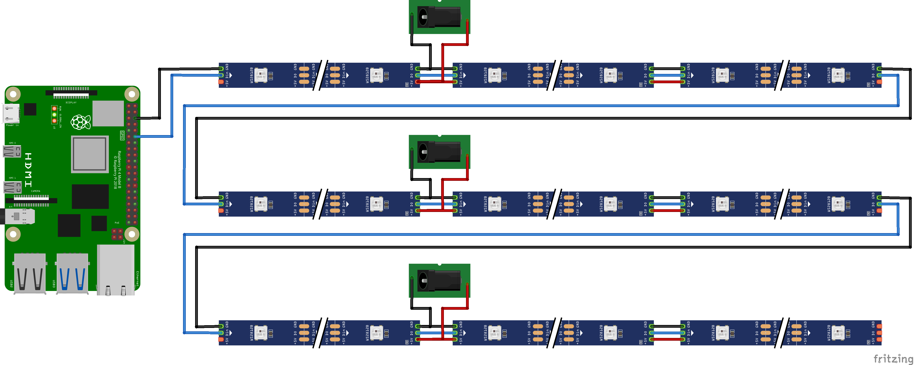

# HelloWorld Sound & Light

Projet de son et lumière pour l'évènement HelloWorld de GCC

## Installation

```bash
sudo apt update
sudo apt full-upgrade
sudo apt install git
cd
git clone https://github.com/ribt/helloworld_sound_light
cd helloworld_sound_light
./install.sh
```

Brancher GND et 5V du bandeau sur GND et 5V de la RPi. Brancher le fil de donnée sur le GPIO18.

## Test

```
sudo $(pipenv --py) strandtest.py
```

## Description et fonctionnement

Les bandeaux utilisés ici sont composés de LEDs WS2812B dont la spec est dispo ici : https://cdn-shop.adafruit.com/datasheets/WS2812B.pdf

Chaque "LED" ("pixel" est plus adapté) WS2812B est en réalité composée de 3 LEDs : rouge, verte, bleue. D'un côté du composant on a les pins GND, Din, 5V et de l'autre côté GND, Dout, 5V. On alimente le composant en 5V sur les pins correspondant et on envoie le signal de contrôle. Le signal reçu sur Din indique la couleur demandée pour chaque pixel du bandeau. Le composant WS2812B prend l'info sur sa pin Din, allume ses trois LEDs RGB en conséquence et retransmet la consigne sur Dout en retirant la consigne concernant le premier pixel.

Un bandeau est composé de plusieurs WS2812B branchés en parallèle. Il est donc théoriquement possible de connecter une infinité de bandeau bout à bout. En pratique, au delà de 150 pixels, on constate que la tension a beaucoup chuté et que le composant fonctionne en mode dégradé,  répétant un signal erroné ce qui a pour conséquence d'avoir un bandeau avec des couleurs aléatoires.

Ce projet utilise des bandeaux de 2 m avec une densité de 30 LEDs/m soit des bandeaux de 60 pixels.

## Branchement

Les règles générales à respecter :
- Le GPIO 18 de la RPi doit être branché sur le Din du 1er bandeau.
- Le Dout du 1er bandeau est branché sur le Din du 2e bandeau et ainsi de suite.
- Tous les GND sont connectés entre eux.
- On branche le +5V d'une alim au premier bandeau. Après 150 LEDs, **on coupe le fil** et on branche une nouvelle alim.

D'après la doc, allumé tout en blanc, un pixel consomme 60 mA. Allumé en rouge, seulement une LED sur 3 est allumée donc il consomme 20 mA. Un bandeau de 60 pixels a donc une conso max théorique de 3.6 A mais si on a prévu des effets colorés on peut facilement avoir une consommation max de 1 A.

Pour des raisons économiques, ce projet utilise des alimentations de 3A. Le logiciel s'assure que la consommation d'un bandeau ne dépasse pas 1A. Une alim peut donc alimenter 3 bandeaux mais en mettant l'alim en bout, la chute de tension serait trop importante. Le montage consiste donc à alimenter 3 bandeaux avec une alim en mettant l'alim "au milieu".



Il est important que les +5V de deux alim différentes ne soient **PAS** connectés entre eux, cela risquerait d'endommager les alim.

